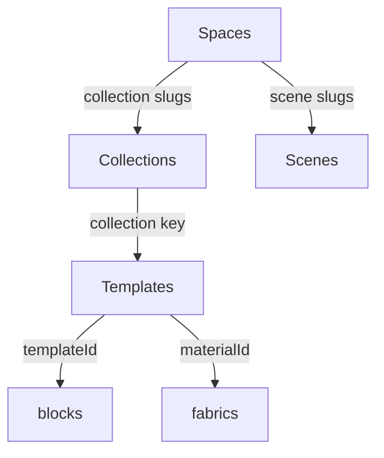

# Const Data Relationships

## Table of Contents
1. [Executive Summary](#executive-summary)
2. [Overview Diagram](#overview-diagram)
3. [Relationship Snapshot](#relationship-snapshot)
4. [Entity Details](#entity-details)
   - [Spaces](#spaces)
   - [Collections](#collections)
   - [Scenes](#scenes)
   - [Templates](#templates)
   - [Blocks](#blocks)
   - [Fabrics](#fabrics)
   - [Avatars](#avatars)
5. [Interaction Flow](#interaction-flow)
6. [Data Integrity Checklist](#data-integrity-checklist)

## Executive Summary
- Spaces define the customer experience and reference collections and scenes by shared slugs.
- Collections group wardrobe assets; their slug is the collection key for templates, blocks, and fabrics.
- Templates describe ready-to-wear looks and expose `templateId`, `category`, and `materialId` joins for blocks and fabrics.
- Blocks are modular garment pieces keyed solely by `templateId` while respecting avatar gender.
- Fabrics store material metadata and resolve via the direct `materialId` reference coming from templates.
- Avatars are the supported 3D bodies; templates and blocks must align on gender to ensure compatibility.

## Overview Diagram

## Relationship Snapshot
- **Space → Collection**: Each space lists one or more collection slugs; those slugs must exist in the collections catalog.
- **Space → Scene**: Spaces reference default and allowed scenes using the same slugs as the scene registry.
- **Collection → Template/Block/Fabric**: Templates, blocks, and fabrics share the same collection slug key, guaranteeing a shared dataset boundary.
- **Template → Block**: Blocks join on `templateId` (matching `template._id`) so only the right pieces assemble.
- **Template → Fabric**: `template.materialId` stores the target fabric's unique ID, resolving to fabrics in the same collection.
- **Template & Block → Avatar**: Gender values link garments to compatible avatars.

## Entity Details

### Spaces
- **Purpose**: Represent showrooms or brand experiences.
- **Key fields**: Slug, collections array, default scene, scenes array, garments count, wholesale flags.
- **Dependencies**: Relies on valid collection slugs for inventory counts and scene slugs for background visuals.

### Collections
- **Purpose**: Act as brand-level catalogs.
- **Key fields**: Slug, name, logo, gender, garments count.
- **Dependencies**: Aggregates templates, blocks, and fabrics by slug; counts are driven by block totals.

### Scenes
- **Purpose**: Provide background environments for spaces.
- **Key fields**: Slug, name, environment assets, optional included models.
- **Dependencies**: Scene slugs are referenced by spaces; shared slugs maintain branding alignment with collections.

### Templates
- **Purpose**: Define full garment offerings.
- **Key fields**: Unique ID, collection slug, category, avatar gender, default material ID, optional extra materials.
- **Dependencies**:
  - Collection slug is the shared collection key for related assets.
  - `materialId` references the fabric's unique ID within the same collection.
  - `templateId` maps to matching blocks.

### Blocks
- **Purpose**: Supply modular garment components for remixing and assembly.
- **Key fields**: Unique ID, collection slug, block category, template ID, avatar gender.
- **Dependencies**:
  - `templateId` enforces compatibility with the parent template.
  - Blank template IDs indicate optional blocks not pre-attached to a template.
  - Avatar gender must match the parent template.

### Fabrics
- **Purpose**: Capture material metadata and texture resources.
- **Key fields**: Unique ID, collection slug, material category, material name, supported template categories, texture maps.
- **Dependencies**:
  - Collection slug constrains availability.
  - Template material IDs resolve to fabrics via direct ID references.
  - Template categories list controls where the fabric can be applied.

### Avatars
- **Purpose**: Enumerate supported 3D body models.
- **Key fields**: Name, gender, thumbnail, source asset, default flag.
- **Dependencies**: Templates and blocks must match avatar gender to avoid geometry conflicts.

## Interaction Flow
1. A user enters a space; the space slug resolves the assigned collections and default scene.
2. Each referenced collection loads its templates, blocks, and fabrics using the shared slug.
3. When a template is selected, its `templateId` locates the appropriate blocks, while the `materialId` resolves the default fabric.
4. Fabrics applied to the template are validated against the collection and template category permissions.
5. Avatar gender from the template (and blocks) selects a compatible body model for rendering.

## Data Integrity Checklist
- Keep collection slugs consistent across spaces, collections, templates, blocks, and fabrics.
- Ensure every template ID is unique within its collection to prevent block collisions.
- Keep `materialId` fields aligned with the target fabric IDs so fabrics resolve correctly.
- Audit blocks with empty template IDs to confirm they are intentional remix options.
- Align avatar gender values between templates, blocks, and the avatar catalog.

